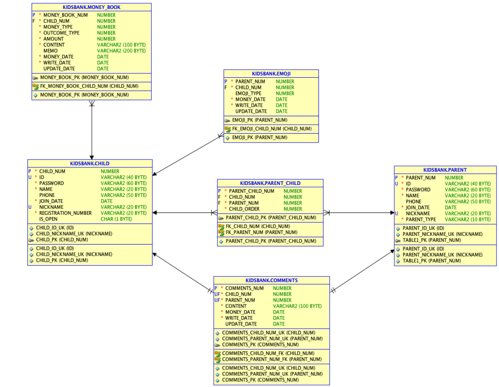
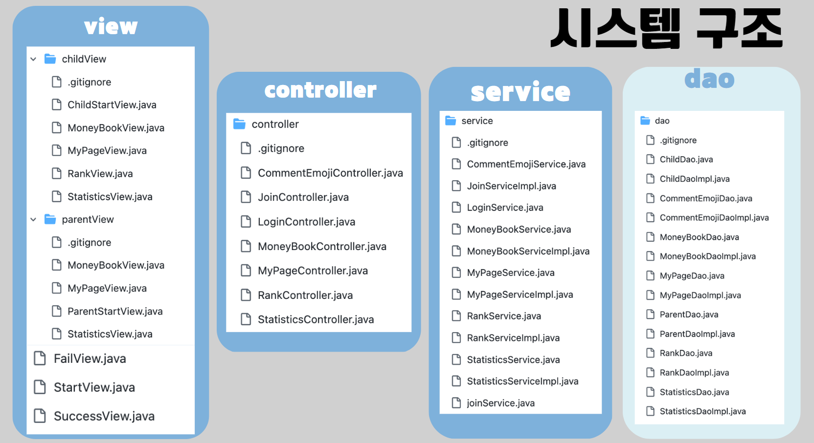

# Kids-Bank-Project

## 어린이 용돈 기입장 서비스

#### 🕛 기간

2023.08.03 ~ 2023.08.04

[ 목차 ]

1. 서비스 개요
2. 주요 기능 소개
3. 기술 스택
4. ERD, MVC
5. 서비스 소개
6. 참여자

## 서비스 개요

자녀가 어떻게 소비하는지 궁금하신가요?

자녀가 용돈 기입장을 작성하고 부모도 함께 관찰할 수 있는
어린이 용돈기입장 프로그램 Kids Bank입니다.

## 🛠️ 주요 기능 소개

- 용돈기입장 작성 : 수입과 지출에 따른 내역을 작성
- 관계 설정 : 부모와 자식 회원을 연결할 수 있는 서비스
- 랭킹 조회 : 지출, 수입, 좋아요 순으로 랭킹을 매기는 랭킹 서비스
- 통계 조회 : 주간, 월간, 연간, 기간에 따른 수입, 지출 내역을 바탕으로 한 통계 서비스
- 좋아요 기능 : 자식의 기입장을 열람하고 좋아요를 줄 수 있는 서비스

## 🕸️ ERD, MVC

## 📺 서비스 소개 (화면)

### Kids Bank 메인화면

### 아이 로그인/회원가입

### 아이 로그인

### 아이 메인화면 & 용돈기입장 등록

### 아이 용돈기입장 조회

### 아이 용돈기입장 삭제

 ### 아이 로그아웃

### 부모 로그인/회원가입

### 부모 회원가입(자녀 가입이 안되어있는 경우, 아이 회원가입 진행 후 다시 부모 회원가입 가능)

### 부모 회원가입(자녀 가입이 되어있는 경우)

### 부모 로그인(연결된 자녀 리스트에서 자녀 선택 가능)

### 부모 메인화면

### 부모 - 자녀 용돈기입장 내역 보기

### 부모 - 자녀 용돈기입장에 좋아요 등록

### 부모 로그아웃

## 참여자 - 역할

|                        강윤서(팀장)                        |                         김대현                          |                         김휘경                         |                           나웅기                            |                         백미수                         |
| :--------------------------------------------------------: | :-----------------------------------------------------: | :----------------------------------------------------: | :---------------------------------------------------------: | :----------------------------------------------------: |
|  |  |  |  |  |
|        [YunseoKang](https://github.com/YunseoKang)         |          [98eogus](https://github.com/98eogus)          |          [hwi215](https://github.com/hwi215)           |        [WoongKi1115](https://github.com/WoongKi1115)        |          [misuqq](https://github.com/misuqq)           |
|                        통계 & View                         |                   기입장 & Controller                   |                       회원 & DB                        |                     마이페이지& Service                     |                  랭킹 & 기입장 & View                  |
